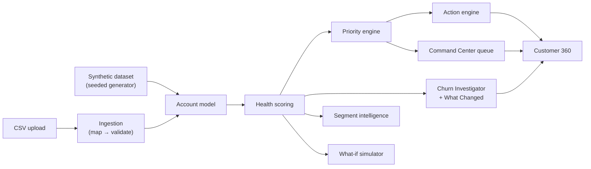

# ChurnLab

Customer retention intelligence for subscription businesses: turns account data into explainable churn risk, revenue exposure, root-cause investigation, and a prioritized queue of what to work on next.

## Overview

Most churn tools answer one question (which customers are likely to leave) and stop there. That's not enough to actually run a retention motion. ChurnLab goes further: which accounts need attention *first*, why they're at risk, how much recurring revenue is on the line, what changed recently, and what a reasonable next step looks like.

It's built as an operational tool, not an analytics notebook. The default view isn't a wall of charts. It's a ranked queue.

## The problem

Recurring revenue makes churn expensive in a way that's easy to under-react to. Losing a customer doesn't just cost that account's revenue; it costs whatever it took to acquire them, and it compounds against future growth instead of just against the current period. A team with limited Customer Success or Account Management capacity can't manually review every account every week, so the real question is always resource allocation: given limited attention, where does it produce the most retained revenue?

A churn-probability score alone doesn't answer that. A 90%-risk account worth $2,000 ARR and a 40%-risk account worth $200,000 ARR are not equally urgent, and a tool that ranks by risk alone will misallocate a team's morning. Risk also isn't useful without a reason attached to it: "this account scores 31/100" doesn't tell anyone what to do differently before a renewal call.

## The solution

ChurnLab's core loop:

```
Customer Data → Health Signals → Risk → Revenue Exposure → Root Cause → Priority → Action
```

Each stage is a real, inspectable computation, not a black box:

- **Health signals** are pulled from usage, adoption, support, sentiment, and billing data.
- **Risk** is a transparent, weighted health score with a traceable list of drivers.
- **Revenue exposure** combines risk with ARR and renewal timing into an economic priority, not risk-only ranking.
- **Root cause** comes from a deterministic Churn Investigator that builds its explanation directly from account data.
- **Priority** produces an ordered queue instead of a scatter of dashboards.
- **Action** maps root causes to a concrete retention playbook, with a transparent cost-vs-exposure comparison.

## Demo data

Everything in this build runs against a synthetic, clearly-labeled demo dataset: 220 active and 42 recently-churned fictional companies, generated deterministically from a seeded random model so the numbers are stable across a session. See [Demo Data](#demo-data-1) below for how it's constructed. No real company data is used anywhere in this repository.

## Key features

- **Retention Command Center:** every active account, ranked by economic priority (risk × revenue × urgency), filterable by risk, priority, industry, tier, owner, and root cause.
- **Customer 360:** a full detail view per account, including health score, drivers, revenue exposure, usage/adoption/support/sentiment/billing detail, and recommended actions.
- **Churn Investigator:** a deterministic, evidence-based explanation of why a given account is classified the way it is. No AI dependency; every sentence traces back to a computed fact.
- **What Changed:** a 30-day before/after comparison (usage, adoption, sentiment, tickets, health score, renewal distance) that explains *why* an account suddenly moved up the priority queue.
- **Retention Action Engine:** root-cause-driven recommendations with urgency and supporting evidence, plus a cost-vs-exposure comparison for each suggested action.
- **What-If Simulator:** three interactive scenarios modeling the revenue impact of a proposed retention effort, clearly labeled as projections.
- **Segment Intelligence:** compares health, risk, and revenue concentration across plan tier, industry, ARR band, company size, adoption tier, and account owner, with findings generated only when the underlying comparison actually supports them.
- **CSV Ingestion:** upload any customer export, get automatic column-to-schema mapping, and see it validated row by row before anything downstream trusts it.
- **Data Quality Console:** Critical/Warning/Informational issues across the live portfolio (missing fields, impossible values, duplicate IDs, stale renewal dates), each labeled with what it affects.

## How it works



Full breakdown in [`docs/ARCHITECTURE.md`](docs/ARCHITECTURE.md).

## SaaS metrics

MRR, ARR, logo/revenue churn, gross and net revenue retention, and revenue-at-risk are all pure, unit-tested functions in [`src/lib/metrics/saas-metrics.ts`](src/lib/metrics/saas-metrics.ts). Formulas, denominators, and known limitations (e.g. NRR currently equals GRR, since there's no expansion-revenue history in this dataset) are documented in [`docs/METRICS.md`](docs/METRICS.md).

## Scoring and prioritization

Health scoring is a weighted-deduction model over usage, adoption, support, sentiment, and billing signals, not an opaque ML prediction. Priority combines health, ARR, and renewal urgency into a percentile-ranked queue. Both are fully documented, including the weights and the reasoning behind them, in [`docs/SCORING.md`](docs/SCORING.md).

## Architecture

- **`src/app`:** Next.js App Router pages. Server components fetch data and run the analytics engines; interactivity (filtering, sorting, sliders) is isolated into small client components.
- **`src/lib`:** all business logic, including the data model and generator, SaaS metrics, health scoring, priority engine, churn investigator, action engine, simulator, segment intelligence, CSV ingestion, and data quality scanning. Every module here is framework-agnostic and independently testable.
- **`src/components`:** UI primitives (Card, Badge, Table, StatTile) and chart wrappers, kept separate from the logic that feeds them.

Full breakdown in [`docs/ARCHITECTURE.md`](docs/ARCHITECTURE.md).

## Tech stack

| Choice | Why |
|---|---|
| Next.js (App Router) + TypeScript | Server components for data-heavy pages, without needing a separate API layer for a self-contained analytics app. |
| Tailwind CSS v4 | Utility-first styling fast enough to keep a dense, table-heavy UI consistent across a dozen pages. |
| Recharts | Composable charts that work cleanly with React server/client component boundaries. |
| Papa Parse | Battle-tested CSV parsing for the ingestion flow, run entirely client-side. |
| Vitest | Fast, TypeScript-native test runner for the analytics layer. |

No database, no external API, and no AI provider. See [`docs/DECISIONS.md`](docs/DECISIONS.md) for why.

## Getting started

Requires Node.js 20.9+ (Next.js 16's minimum).

```bash
npm install
npm run dev
```

Open [http://localhost:3000](http://localhost:3000). The synthetic dataset generates on first request, with no setup, seed data, or environment variables required.

Other commands:

```bash
npm run build   # production build
npm run start   # run the production build
npm run lint    # eslint
npm test        # vitest, single run
npm run test:watch
```

## Demo data

Every account in the app (names, industries, usage numbers, support tickets, all of it) is synthetically generated by [`src/lib/data/generator.ts`](src/lib/data/generator.ts) from a fixed random seed. It is not real customer data, and no external data source is used. The generator biases correlated fields together using named risk archetypes (usage decline, low adoption, support friction, sentiment drop, billing risk, compound risk), so an unhealthy account has a believable cluster of symptoms instead of independently randomized numbers that happen to look bad. A small share of accounts is generated with intentionally invalid data (negative ARR, active users exceeding licensed seats, stale renewal dates) so the Data Quality Console has real issues to catch.

A separate sample CSV at [`public/sample-data/churnlab-sample-messy.csv`](public/sample-data/churnlab-sample-messy.csv) is bundled for testing the ingestion flow. It has mismatched column names, a missing required field, a negative ARR value, an unparseable date, and a duplicate account ID, and can be loaded directly from the Data Ingestion page.

## Example account investigation

Opening any high-priority account in Customer 360 (for example, one of the Critical-priority accounts surfaced at the top of the Command Center) shows the Churn Investigator's summary first: a one-sentence explanation naming the top one or two drivers (e.g. declining engagement and unresolved support tickets) ahead of an imminent renewal, followed by section-by-section evidence for engagement, adoption, support, sentiment, renewal timing, and billing. The What Changed panel alongside it shows the same account's health score, usage, and ticket counts 30 days ago versus today, so it's clear *why* the account moved to the top of the queue rather than just *that* it did. Every number in both panels is read directly from the account record; none of it is generated text.

## Testing

Unit tests cover the business-logic layer in `src/lib`: SaaS metric formulas, health-score deduction and clamping behavior, priority ranking and tiering, churn/revenue-at-risk calculations, action-recommendation selection and cost economics, the three what-if scenario functions, and CSV schema mapping/validation (missing fields, malformed values, negative ARR, duplicate IDs, active-users-exceeds-seats). Tests deliberately focus on calculations that would silently produce wrong numbers if broken, not on static UI copy.

```bash
npm test
```

## Limitations

- **All data is synthetic.** Nothing here reflects real companies, real usage patterns, or a real churn base rate.
- **Health-score weights are a reasonable prior, not a calibrated model.** They haven't been fit against real retained/churned outcomes. See `docs/SCORING.md`.
- **Correlation isn't causation.** A support-ticket spike being associated with risk doesn't mean it's the sole cause of it for any given account.
- **NRR currently equals GRR.** There's no per-account expansion/contraction history in this dataset to compute genuine net retention from. See `docs/METRICS.md`.
- **Retention recommendations are advisory.** The action engine suggests a next step and shows the economic tradeoff. It does not, and should not, claim a probability of success.
- **CSV ingestion validates and previews but doesn't merge into the live portfolio in this build.** See `docs/ROADMAP.md`.

## Roadmap

Organized into Now / Next / Later in [`docs/ROADMAP.md`](docs/ROADMAP.md).

## Documentation

- [`docs/PRODUCT.md`](docs/PRODUCT.md): target users, jobs to be done, principles
- [`docs/METRICS.md`](docs/METRICS.md): SaaS metric formulas and their limitations
- [`docs/SCORING.md`](docs/SCORING.md): health scoring and prioritization, in full
- [`docs/ARCHITECTURE.md`](docs/ARCHITECTURE.md): data flow and code layout
- [`docs/DECISIONS.md`](docs/DECISIONS.md): why the product is built the way it is
- [`docs/ROADMAP.md`](docs/ROADMAP.md): what's next
