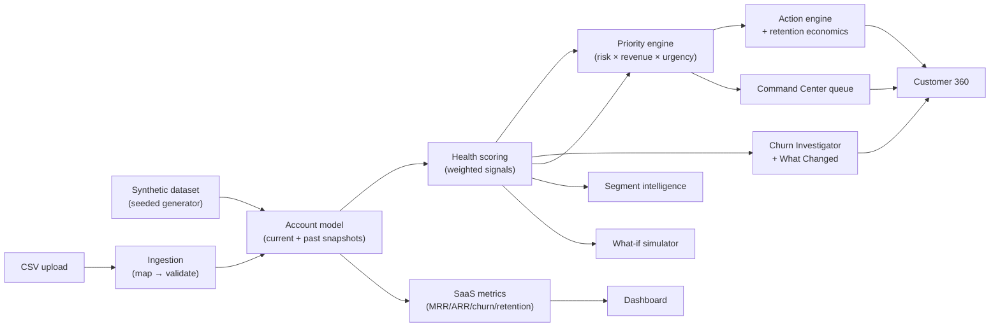

# ChurnLab: Architecture

## Data flow



Every downstream feature (the dashboard, the command center queue, the investigator, the simulator) reads from the same two computed values per account: a `HealthResult` and a `PriorityResult`. There's a single place ([`src/lib/metrics/portfolio.ts`](../src/lib/metrics/portfolio.ts)) that computes both for a list of accounts and caches the result, so every page sees consistent numbers for the same account instead of each page re-deriving its own version.

## Layers

```
src/
  app/                  Next.js App Router routes (pages + page-local client components)
  components/
    ui/                 Generic primitives: Card, Badge, Table, StatTile, Button, Select
    charts/             Recharts wrappers, presentational only, no data logic
    layout/              Sidebar navigation
    customer360/         Components specific to the account detail page
  lib/
    data/                Types, seeded RNG, synthetic generator, in-memory dataset accessor
    metrics/              SaaS metrics, portfolio composition, dashboard summary aggregation
    scoring/               Health score engine
    priority/               Revenue-at-risk / priority engine
    investigator/            Churn Investigator + What Changed
    actions/                  Action recommendation engine + retention economics
    simulator/                 What-if scenario functions
    segments/                   Segment intelligence + findings generation
    ingestion/                   CSV parsing, canonical schema, column mapping, row validation
    quality/                      Shared issue types + live-portfolio quality scanner
    utils/                         Formatting, class-name, color helpers
```

**Analytics logic lives in `lib/`, not in components.** Every scoring, prioritization, and metrics function is a pure function over plain data (`Account[]`, `HealthResult`, etc.) with no dependency on React or Next.js. This is what makes the `.test.ts` files alongside each module possible without any UI test harness, and it's what lets a page component stay a thin composition of "fetch accounts → run engines → pass plain props to a table."

**Pages are server components by default; interactivity is isolated into small client components.** The Command Center table, for instance, is a server page that computes rows once, and a client `CommandCenterTable` that only owns filter/sort UI state. It never recomputes health or priority itself.

## Data model

`Account` ([`src/lib/data/types.ts`](../src/lib/data/types.ts)) carries two `MetricsSnapshot`s, `current` and `past` (~30 days prior), rather than a full time series. This is a deliberate scope decision: it's enough to power What Changed, trend-based deductions in the health score, and 30-day usage comparisons, without building out a general time-series store for a synthetic demo dataset. See `docs/DECISIONS.md`.

## Dataset generation

The synthetic dataset ([`src/lib/data/generator.ts`](../src/lib/data/generator.ts)) is a seeded, deterministic generator (`mulberry32` PRNG). The same seed always produces the same 220 active + 42 churned accounts, so numbers are stable across a session without needing a database. Accounts are generated from weighted **archetypes** (thriving, steady, usage-decline, low-adoption, support-friction, sentiment-drop, billing-risk, compound-risk) that bias correlated fields together, so a "usage decline" account has a believable cluster of symptoms rather than independently randomized metrics that happen to include a usage drop. A small fraction of accounts are deliberately generated with invalid data (negative ARR, seats exceeded by active users, renewal dates in the past) specifically to give the Data Quality Console something real to find.

## Why no backend

Given the scope (a synthetic dataset regenerated per server process, and CSV ingestion that runs entirely client-side) there was no case for a database or API layer. `src/lib/data/dataset.ts` holds the generated dataset in a module-level cache for the life of the server process. A real deployment connecting to live billing/product-usage/support systems would replace that module with real data-fetching, without needing to change anything in `scoring/`, `priority/`, `metrics/`, or any page: they all consume the same `Account[]` shape regardless of where it came from.
